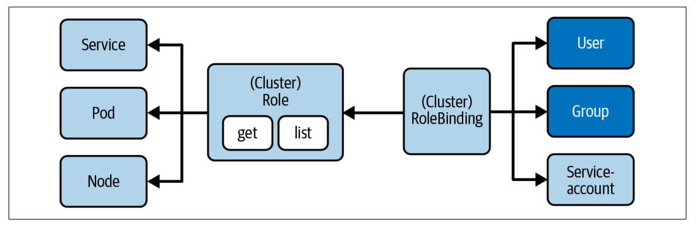

# Cluster Architecture, Installation and Configuration

## RBAC (Role based access model) high-level overview

### What is RBAC?
Is a security model in k8s that regulates access to resources based on the roles assigned to users, groups and service accounts. It ensures that only authorized users or processes can perform specific actions on the Kubernetes API (kube-apiserver).

It's enabled by default (k8s > 1.6), provides fine grained permissions system where administrators define which subjects (users, group, or service accounts) can perform specific action (verbs) on particular resources.

Helps with implementing a variety of use cases:
* Establishing a system for users with different roles to access a set of Kubernetes resources
* Controlling processes running in a pod and the operations they can perform via the Kubernetes API
* Limiting the visibility of certain resources per namespace

RBAC consists of three building blocks that connect to the privitive apis

### RBAC Best practices

* Least privilege principle
* Use service accounts instead of root access (avoid using `cluster-admin` for applications)
* Regularly audit and review permissions (eg: `kubectl auth can-i create pods`) to check permissions
* Disable anonymous access - Ensure `--anonymous-auth=false` config is set in the API Server
* Use ClusterRoles for Shared access control - Instead of defining multiple Roles across namespaces 

### RBAC Primitives

RBAC (**Role-Based Access Control**) in Kubernetes is built upon **four key API primitives**:

| **RBAC Object**         | **Scope**   | **Purpose**                                           |
|-------------------------|------------|------------------------------------------------------|
| **Role**               | Namespace   | Defines permissions within a namespace.             |
| **ClusterRole**        | Cluster     | Defines cluster-wide permissions.                   |
| **RoleBinding**        | Namespace   | Assigns a **Role** to a user, group, or service account. |
| **ClusterRoleBinding** | Cluster     | Assigns a **ClusterRole** to a user, group, or service account. |
