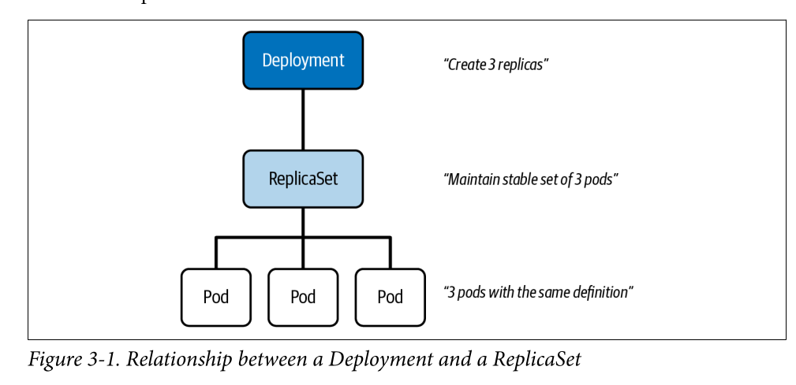

# Managing Workloads

## What is a workload in Kubernetes?

A **workload** refers to an application running on Kubernetes. It's the collection of resources (pods) needed to run a particular application or service. A workload defines how Kubernetes should manage and orchestrate these resources -- whether they scaling, restarts, parallelism, etc.

## What are the key components of a Workload?

### Pod

The pod is the smallest and simplest unit in Kubernetes, it encapsulates **one or more containers**, shared storage (volumes), and a network IP.

Pods are usually ephemeral, so higher-level controllers (ReplicaSets/Deployments) are used to manage them.

### ReplicaSet

This kubernetes object ensures a specified number of identical Pods are running at any given time, usually managed by higher-level controllers like Deployments (it's not common to handle a replica set manually).

### Deployment

The **most common workload controller** for stateless applications; they define the desired state (number of replicas, image version, arguments, secrets, configs, etc..); **support rolling updates and rollbacks**.

### StatefulSets

A kubernetes object suitable for stateful applications (like databases), they ensure ordered and unique pod creation and stable network identities, tightly integrated with PersistentVolumes for stable storage.  This object can also consider ordered deployment and scaling. 

### DaemonSet

A DaemonSet, ensures a copy of a Pod runs on every (or some) nodes, it's useful for node-level services like monitoring agents, log-collectors or network plugins. It's useful for task that must be performed on every node. 

### CronJob/Job

This kubernetes object creates jobs on a time-based schedule, it's used for recurring tasks, report generation, and other scheduled operations. They key difference between a Job and a Cronjob, it's the schedule. 

### Custom Resource Definiton (CRDs)

These type of objects are built to extend the functionality of Kubernetes by defining your own workload types. Useful when you need custom controllers to manage application lifecycles in ways not covered by built-in controllers, allowing you to define new behavior for your custom resources. 

## Extra controller/objects for Workload Management

### Horizontal Pod Autoscaler

The Horizontal pod autoscaler (HPA) automatically scales (up/down) the number of pods in a Deployment/StatefulSet/ReplicaSet based on CPU, Memory, or custom metrics.

They tipically rely on the Kubernetes Metrics Server to support the scaling operations. 

### Vertical Pod Autoscaler

This object scales vertically (increasing resources) for pods automatically, it's less common than HPA but critical for optimizing resource usage in stable environments.

It's useful for reducing the manual tuning and adjusting resource requests/limits. 

An important consideration, VPA must restart the pod to apply resource changes, this may cause temporary disruptions (due to the cgroups usage underneath).

### Service

A service expose a set of pods under a single IP and load balances traffic between them, can expose workloads internally (ClusterIP), externally (NodePort) or via Cloud Load Balancers (eg: AWS ELB). It relies on Layer 4 (TCP/UDP).

### Ingress

An ingress is a k8s object that manages external access to services within a cluster, tipically HTTP/HTTPS. They act as a gateway, allowing external users to accesss services running inside your kubernetes cluster.

It defines routing rules based on factors like Hostnames/UrlPaths and consolidates a single entry point for external traffic simplifying management. Operates at Layer 7 (application)